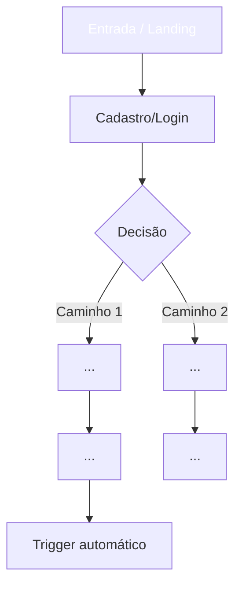
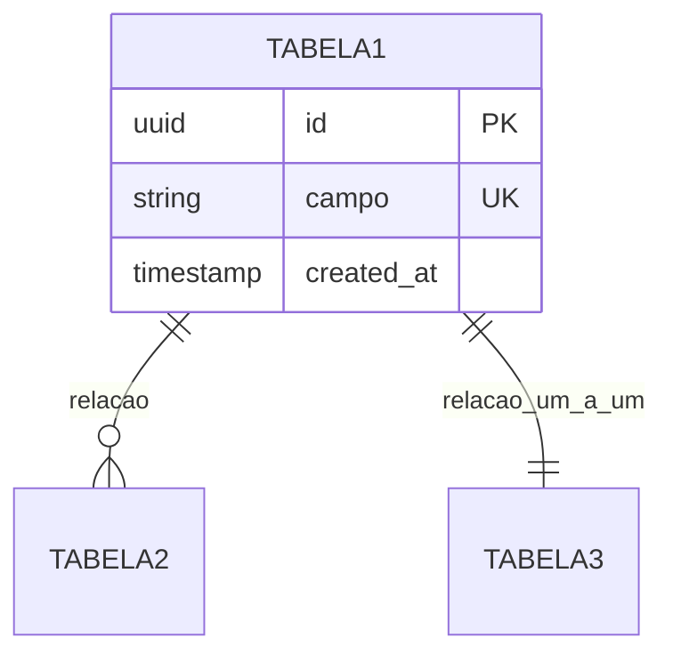
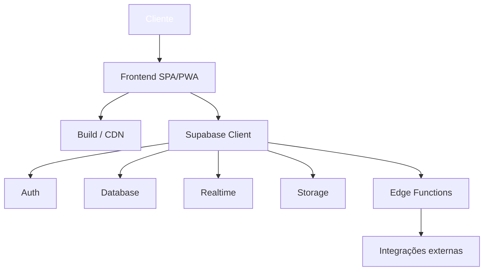

# Estrutura do PRD — Referência Detalhada

Este documento descreve as 9 seções obrigatórias de um PRD gerado por esta skill. Use como guia ao montar cada seção. Para calibragem de profundidade e tom, leia também `example_prd.md`.

---

## Seção 1 — Visão Geral

**Formato:** 4 parágrafos densos em prosa contínua. Sem bullets, sem tabelas.

**Estrutura:**

1. **Parágrafo 1 (O quê + problema):** Apresente o produto, qual problema crítico resolve e por que esse problema importa. Cite dores específicas do público-alvo. Termine resumindo a proposta de valor.

2. **Parágrafo 2 (Como funciona):** Descreva o ecossistema da solução em alto nível — quem faz o quê, em quais telas/fluxos, como os módulos se conectam. Foque na experiência, não na tecnologia.

3. **Parágrafo 3 (Público-alvo):** Detalhe persona primária e secundária. Descreva contexto, dores, comportamento esperado. Seja concreto.

4. **Parágrafo 4 (Diferenciais):** Liste 4-5 diferenciais numerados em texto corrido (ex: "**1. Automação X**, fazendo Y; **2. Z**, ..."). Cada diferencial deve ser real, não genérico.

**Anti-padrões:**
- Frases vazias como "solução inovadora", "experiência única", "tecnologia de ponta".
- Repetir o nome do produto excessivamente.
- Não citar o problema concreto.

---

## Seção 2 — Funcionalidades

### 2.1 Perfis de Usuário (tabela obrigatória)

```markdown
| Perfil | Registro | Permissões | Acessos Principais |
|---|---|---|---|
| **Nome do Perfil** | Como se cadastra | O que pode fazer | Páginas/módulos que acessa |
```

Mínimo 2 perfis, máximo 5. Sempre inclua perfis com diferentes níveis de permissão se o produto tiver multi-usuário. Para produtos com avaliador/cliente anônimo, registre explicitamente "Nenhum registro" no campo Registro.

### 2.2 Módulos do Sistema (lista numerada)

Liste **10-12 módulos**. Cada módulo segue o formato:

```markdown
N. **Nome do Módulo** — Descrição em 1-3 frases explicando o que faz, como se conecta com outros módulos e que tecnologia/decisão chave o sustenta.
```

Módulos típicos (adapte ao produto):
- Autenticação & Autorização
- Onboarding
- Módulo central de negócio (varia)
- Dashboard / Métricas
- Sistema de Notificações
- Exportação / Relatórios
- Configurações
- Auditoria / Logs
- Integrações externas (pagamento, e-mail, WhatsApp etc.)

### 2.3 Páginas Principais (tabela obrigatória)

```markdown
| Página | Módulo | Descrição | Elementos-Chave da Interface |
|---|---|---|---|
| **Nome da Página** | Módulo pai | O que o usuário faz aqui | Componentes UI listados |
```

Mínimo 8 páginas, máximo 15. Inclua sempre:
- Landing page pública (se aplicável)
- Login/Cadastro
- Tela inicial pós-login (dashboard ou home)
- Telas principais de cada módulo
- Configurações
- Página pública/de cliente final (se houver)

---

## Seção 3 — Processos de Navegação e Fluxo

Descreva a **jornada completa de cada perfil** em passos numerados. Para cada perfil principal (admin, usuário final, etc.), monte um fluxo.

**Formato:**

```markdown
### Nome do Perfil — Contexto da Jornada (ex: Primeiro Uso, Operação Diária)

1. **Etapa:** descrição da ação e o que o sistema faz.
2. **Etapa:** ...
```

Inclua pelo menos 2 jornadas: a do operador/admin (criação, configuração, gestão) e a do usuário final (consumo, ação principal). Adicione jornadas extras para perfis adicionais ou cenários críticos (ex: "Resposta a Alerta", "Onboarding Pago").

Cada jornada deve ter **6-10 passos**. Passos genéricos demais ("usa o sistema") são fracos; passos concretos ("clica em 'Iniciar Prova' → sistema solicita voucher → valida → libera acesso") são fortes.

---

## Seção 4 — Diagrama de Fluxo Completo

Diagrama Mermaid `graph TD` com **20-30 nós** cobrindo todas as jornadas.

**Estrutura recomendada:**



**Regras:**
- Use `%%` para agrupar seções (Perfil 1, Perfil 2, Sistema, Integrações).
- Use diferentes formas para diferentes tipos de nó: `[]` para ações, `{}` para decisões, `(())` para início/fim.
- Aplique `style` em 5-8 nós-chave para destacar visualmente.
- Conecte sempre o fluxo do cliente/usuário final com triggers automáticos do sistema (notificações, alertas).

---

## Seção 5 — Design Interface

### 5.1 Estilo Visual

Inclua:

**Princípios Visuais** (3-5 bullets sobre filosofia de design):
- Ex: "Simples acima de bonito", "Mobile-first", "Acessível WCAG AA"

**Sistema de Cores** em bloco de código:
```
PRIMÁRIAS:
- #HEX (Nome) — Onde é usado

SEMÂNTICAS:
- #HEX — Sucesso
- #HEX — Erro
- ...

NEUTROS (escala completa):
- #HEX (slate-900) — Texto principal
- ...
```

**Sistema Tipográfico** em bloco de código:
```
FONTE: Inter (Google Fonts), fallback: -apple-system

HIERARQUIA:
- H1: 28px / 1.2 / 700
- H2: 22px / 1.3 / 600
- Body: 15px / 1.5 / 400
- ...
```

**Sistema de Componentes** em bloco de código (botões, cards, inputs, navegação) com especificações de altura, radius, padding, estados.

### 5.2 Tabela de Páginas Detalhada

```markdown
| Página | UI Principal | Componentes Críticos | Interações & Micro-interações |
|---|---|---|---|
```

Mesmas páginas da seção 2.3, mas agora com foco em UI/UX (não funcionalidade).

### 5.3 Responsividade

Documente **3 breakpoints** com layout e ajustes específicos:

- **MOBILE (320-767px)** — geralmente experiência primária para SMB/B2C
- **TABLET (768-1199px)** — cenários híbridos (kiosk, balcão, gestão móvel)
- **DESKTOP (≥1200px)** — gestão pesada, dashboards complexos

Em cada breakpoint, descreva: layout grid, navegação, ajustes de componentes, touch targets.

Adicione **Estados Especiais**: offline, conexão lenta, modo escuro, acessibilidade.

---

## Seção 6 — Modelo de Dados

### 6.1 Diagrama ER (Mermaid)



Mínimo 6 tabelas, ideal 8-12. Para cada tabela, liste campos principais com tipos.

### 6.2 SQL Completo (PostgreSQL)

Schema executável e completo. Para CADA tabela inclua:

```sql
-- ============================================
-- TABELA: nome_tabela (descrição)
-- ============================================
CREATE TABLE nome_tabela (
    id UUID DEFAULT gen_random_uuid() PRIMARY KEY,
    -- campos com tipos corretos e NOT NULL onde apropriado
    created_at TIMESTAMP WITH TIME ZONE DEFAULT NOW()
);

-- Índices estratégicos
CREATE INDEX idx_tabela_campo ON nome_tabela(campo);

-- RLS sempre habilitado
ALTER TABLE nome_tabela ENABLE ROW LEVEL SECURITY;

-- Políticas específicas
CREATE POLICY "descrição clara" ON nome_tabela
    FOR ACTION USING (condição);
```

**Inclua quando fizer sentido:**
- **Triggers** para atualizar agregados (médias, contadores)
- **Funções** para enforcer regras de negócio (limites de plano)
- **Constraints CHECK** para validação no banco
- **Foreign keys com ON DELETE** apropriado (CASCADE, SET NULL)

**Boas práticas:**
- UUID como PK em todas as tabelas
- `created_at` e `updated_at` sempre que houver mutação
- JSONB para campos flexíveis (metadata, settings, options)
- Hash de dados sensíveis (IP, tokens) quando aplicável
- Constraints UNIQUE em campos críticos (email, slug)

---

## Seção 7 — Arquitetura

### 7.1 Diagrama de Arquitetura (Mermaid)



Mostre frontend, backend (Supabase ou outro), integrações externas, fluxos de dados principais.

### 7.2 Stack Tecnológica

Organize por categoria com **biblioteca + versão + propósito de uso**:

- **Frontend Core:** React 18, TypeScript 5, Vite 5
- **Estilização:** Tailwind CSS 3, Headless UI, Lucide React
- **Backend (BaaS):** Supabase (Auth, DB, Realtime, Storage, Edge Functions)
- **Estado:** Zustand + TanStack Query
- **Roteamento:** React Router DOM 6
- **Formulários:** React Hook Form + Zod
- **Visualização:** Recharts (ou Chart.js)
- **Integrações:** liste serviços externos (Resend, Stripe, WhatsApp API etc.)
- **Observabilidade:** Sentry, PostHog

Ajuste a stack ao contexto. Não force tecnologias desnecessárias.

### 7.3 Estrutura de Pastas

Mostre árvore de diretórios realista:

```
src/
├── app/
│   ├── routes/
│   │   ├── public/
│   │   ├── auth/
│   │   ├── dashboard/
│   │   └── ...
│   └── App.tsx
│
├── components/
│   ├── ui/
│   ├── layout/
│   └── shared/
│
├── hooks/
├── stores/
├── lib/
├── types/
├── services/
└── assets/

supabase/
├── functions/
└── migrations/
```

### 7.4 Fluxo de Dados Principais

Liste 4-6 fluxos críticos descritos em passos:

```markdown
1. **Nome do Fluxo:** Passo 1 → Passo 2 → Passo 3 → resultado final.
```

Exemplos típicos:
- Onboarding completo
- Ação principal do usuário final
- Trigger automático (alerta, notificação)
- Dashboard em tempo real
- Exportação / batch jobs

### 7.5 Segurança

Bullets sobre práticas implementadas:
- Row Level Security (RLS) com exemplos
- Rate limiting onde necessário
- HTTPS obrigatório
- Validação dupla (Zod + DB constraints)
- JWT com expiração e refresh
- LGPD / GDPR compliance
- Sanitização de inputs

### 7.6 Estratégia de Deploy (opcional)

Onde frontend, backend e domínios serão hospedados.

---

## Seção 8 — Métricas de Sucesso do MVP

Tabela com metas concretas:

```markdown
| Métrica | Meta nos primeiros 90 dias |
|---|---|
| Usuários cadastrados | XXX |
| Usuários ativos | XXX |
| Taxa de conclusão do onboarding | ≥ XX% |
| Métricas específicas do produto | ... |
| NPS / Satisfação | ≥ XX |
```

Adapte ao produto. Inclua sempre: cadastros, ativos, taxa de conversão chave, NPS.

---

## Seção 9 — Roadmap Pós-MVP

Liste fases futuras com features previstas:

```markdown
**Fase 2 — Tema (gatilho/condição):**
- Feature 1
- Feature 2

**Fase 3 — Tema:**
- ...
```

Tipicamente:
- **Fase 2 — Monetização** (após validação)
- **Fase 3 — Insights/IA** (dados acumulados)
- **Fase 4 — Expansão** (novos mercados, integrações)

---

## Checklist de qualidade antes de salvar

Antes de gravar o arquivo, verifique:

- [ ] As 9 seções estão presentes na ordem correta?
- [ ] Visão Geral tem 4 parágrafos densos (não bullets)?
- [ ] Tabela de Perfis tem 2-5 perfis com permissões claras?
- [ ] Tabela de Páginas tem 8-15 páginas?
- [ ] Lista de Módulos tem 10-12 itens com descrição rica?
- [ ] Diagrama de Fluxo tem 20-30 nós?
- [ ] Mermaid está sintaticamente válido?
- [ ] SQL é executável (não pseudo-código)?
- [ ] RLS está habilitado em todas as tabelas com dados de usuário?
- [ ] Stack está adaptada ao produto (não copy-paste genérico)?
- [ ] Estrutura de pastas reflete os módulos descritos?
- [ ] Tudo em português-BR?
- [ ] Nome do arquivo está em snake_case sem acentos?
